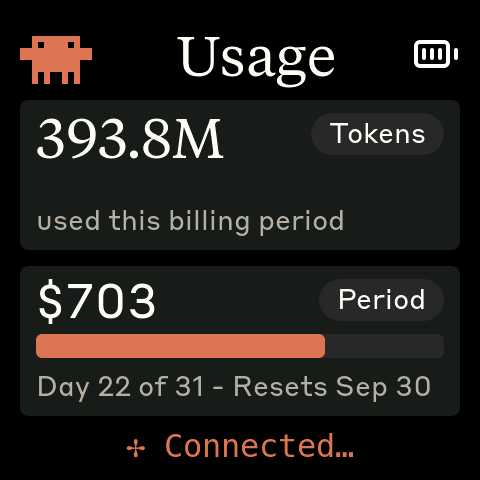

# Clawdmeter


A small ESP32 dashboard I made for my desk to keep an eye on Claude Code usage.

It runs on a [Waveshare ESP32-S3-Touch-AMOLED-2.16](https://www.waveshare.com/esp32-s3-touch-amoled-2.16.htm?&aff_id=149786) as well as a few other alternative boards and pairs over Bluetooth, the splash screen plays pixel-art Clawd animations that get
busier when your usage rate climbs. The two side buttons send Space and
Shift+Tab over BLE HID for Claude Code's voice mode and mode-toggle shortcuts.


## Quick start (macOS, board already flashed)

Two ways to get the daemon running. Both need Claude Code logged in on this Mac first (`claude auth login`).

**Homebrew** — recommended; `brew upgrade` keeps it current:

```bash
brew install ALVARR55/clawdmeter/clawdmeter && clawdmeter-setup
```

**One-line installer** — no Homebrew needed:

```bash
curl -fsSL https://github.com/ALVARR55/Clawdmeter/releases/latest/download/install-from-release.sh | bash
```

Either way: click **Allow** when macOS asks whether "python3.12" may use Bluetooth, then pair the board — *System Settings → Bluetooth → Connect "Clawdmeter"* (hold the board's PWR button 3 s and release if it isn't showing "To pair…"). A Clawdmeter icon appears in the menu bar: amber while it waits for the board, green once data is flowing. The daemon starts at every login from then on.

**Give your board a name** (optional, but handy when several are around). Plug it in over USB and run:

```bash
clawdmeter-flash --name Ricardo        # board now advertises as "Clawdmeter-Ricardo"; no re-flash
```

Up to 7 letters, digits, `-` or `_`. The name is stored on the board and shows on its pairing screen. `clawdmeter-flash --name -` goes back to plain "Clawdmeter". A Mac that already knew the board keeps the old name; rename it there with the ⓘ button.

Something off? The icon's menu links to the [troubleshooting FAQ](https://alvarr55.github.io/Clawdmeter/troubleshooting.html). Flashing a board yourself, and the Linux/Windows daemons, are covered further down.

## Screens

The device boots into the splash. Tap the screen anywhere to switch to the Usage view; tap again to flip back to the splash.

|              Splash               |          Usage (Pro / Max)          |             Usage (Enterprise)              |
| :-------------------------------: | :---------------------------------: | :-----------------------------------------: |
|  |      |    |
|   Splash; touch-toggle anytime    |   Session and weekly utilization    | Tokens this cycle and real $ spent          |

Pro and Max seats show the two rate-limit windows. Enterprise seats with a usage-based (unlimited-spend) plan have no window to show a percentage of, so the boxes switch to **Tokens** — tokens used this billing cycle, summed from your local Claude Code transcripts — and **Period** — the dollar figure from the Claude Desktop *Usage* tab, over a day-of-cycle bar. Both show `---` until the daemon has sent them (currently the macOS daemon).

While the splash is up, the middle (PWR) button cycles animations. **Hold the power button for 3 seconds, then release, to put the device into pairing mode** — this clears the saved Bluetooth bond and re-advertises. The firmware also auto-rotates animations every 20 s within the current usage-rate group, so a long stretch on the splash isn't just one Clawd on loop.

## Hardware

Boards supported out of the box:

- [Waveshare ESP32-S3-Touch-AMOLED-2.16](https://www.waveshare.com/esp32-s3-touch-amoled-2.16.htm?&aff_id=149786)
- [Waveshare ESP32-C6-Touch-AMOLED-2.16](https://www.waveshare.com/esp32-c6-touch-amoled-2.16.htm?&aff_id=149786)
- [Waveshare ESP32-S3-Touch-AMOLED-1.8](https://www.waveshare.com/esp32-s3-touch-amoled-1.8.htm?&aff_id=149786)
- [Waveshare ESP32-C6-Touch-AMOLED-1.8](https://www.waveshare.com/esp32-c6-touch-amoled-1.8.htm?&aff_id=149786)
- [Waveshare ESP32-S3-Touch-AMOLED-2.06](https://www.waveshare.com/esp32-s3-touch-amoled-2.06.htm?&aff_id=149786)
- [Waveshare ESP32-S3-Touch-LCD-1.54](https://www.waveshare.com/esp32-s3-lcd-1.54.htm?sku=33869&aff_id=149786)
- [Waveshare ESP32-S3-Touch-LCD-4](https://www.waveshare.com/esp32-s3-touch-lcd-4.htm)

> Please check if a pull request exists for your alternative hardware port before opening a new one, providing QA feedback and testing on the same hardware is more valuable than duplicate pull requests.

**Porting to another board:** the firmware is a thin HAL with per-board folders under `firmware/src/boards/`. Drop in a new folder and a new PlatformIO env — `main.cpp`, `ui.cpp`, and `splash.cpp` never need to change. See [`docs/porting/adding-a-board.md`](docs/porting/adding-a-board.md) for the walk-through and [`docs/porting/hal-contract.md`](docs/porting/hal-contract.md) for the interfaces a port must implement.

## Prerequisites

- Linux (tested on Ubuntu), macOS, or Windows 10/11
- [PlatformIO CLI](https://docs.platformio.org/en/latest/core/installation/index.html)
- Linux: `curl`, `bluetoothctl`, `busctl`, `dbus-monitor` (BlueZ Bluetooth stack), `python3`, `setsid`, `stdbuf` (util-linux / coreutils), `systemctl` (systemd user services)
- macOS: `python3` (the installer sets up a venv with `bleak` and `httpx`)
- Windows: `python3` 3.11+ (the installer sets up a venv with `bleak`, `httpx`, and `pystray`)
- Claude Code with an active subscription

## macOS installation

The macOS host pieces — Python daemon, LaunchAgent, and flash helper — were ported by [Chris Davidson (@lorddavidson)](https://github.com/lorddavidson). Thanks Chris!

### Install from a release (no build tools)

If your board is already flashed and you just want the daemon — or you want the current firmware without installing PlatformIO — use the [release artifacts](https://github.com/ALVARR55/Clawdmeter/releases/latest):

```bash
curl -fsSL https://github.com/ALVARR55/Clawdmeter/releases/latest/download/install-from-release.sh | bash
```

That downloads the daemon into `~/.clawdmeter`, creates its Python venv, registers and loads the LaunchAgent (auto-starts at login, restarts if it crashes), then watches its first start and tells you whether Bluetooth is reachable. macOS asks once whether "python3.12" may use Bluetooth — click Allow. No questions, no Ctrl-C. Re-running it later upgrades in place. To flash a board with the matching prebuilt image — one merged `.factory.bin` per board is attached to every release:

```bash
cd ~/.clawdmeter && ./flash-release.sh waveshare_amoled_216_c6 --name Ricardo   # or any board env; --name is optional
```

**Or with Homebrew** (same result, and `brew upgrade` keeps it current):

```bash
brew install ALVARR55/clawdmeter/clawdmeter
clawdmeter-setup                # starts the login service; click Allow when macOS asks if Python may use Bluetooth
clawdmeter-flash waveshare_amoled_216_c6 --name Ricardo   # optional: flash the matching release firmware
```

`--name <suffix>` gives the board its own Bluetooth name, **Clawdmeter-Ricardo** (up to 7 letters, digits, `-` or `_`), so several boards can be told apart in the pairing list and on the board's own pairing screen. It's stored on the board; rename any time with `clawdmeter-flash --name <suffix>` (no re-flash), or `--name -` to go back to plain Clawdmeter. The daemon accepts any `Clawdmeter-…` name.

If you previously installed from a checkout or the release tarball, stop that LaunchAgent first so two daemons don't fight over the board: `launchctl unload ~/Library/LaunchAgents/com.user.claude-usage-daemon.plist`. The tap ([ALVARR55/homebrew-clawdmeter](https://github.com/ALVARR55/homebrew-clawdmeter)) bumps its formula to each new release automatically.

Releases are built by [`.github/workflows/release.yml`](.github/workflows/release.yml) on every `v*` tag. The steps below are the from-source equivalent.

### Flash the firmware

```bash
./flash-mac.sh waveshare_amoled_216                       # ESP32-S3 2.16" (auto-detects /dev/cu.usbmodem*)
./flash-mac.sh waveshare_amoled_216_c6                    # ESP32-C6 2.16" variant
./flash-mac.sh waveshare_amoled_18  /dev/cu.usbmodem1101  # ESP32-S3 1.8" (or pass an explicit USB serial port)
```

The board env name is required. Run `./flash-mac.sh` with no args to see the available envs (scraped from `firmware/platformio.ini`).

### Pair the device

After flashing, open **System Settings → Bluetooth** and click _Connect_ next to "Clawdmeter". The daemon only ever connects to the peripheral this Mac is paired/connected to — it never scans for a nearby device — so once it's connected here the daemon picks it up on its next poll (~60 s).

### Install the daemon

The daemon reads your Claude OAuth token from the macOS Keychain (service `Claude Code-credentials`), polls usage every 60 s, and pushes it to the display over BLE.

```bash
./install-mac.sh
```

The installer creates a Python venv in `daemon/.venv/`, installs the daemon's dependencies, renders a LaunchAgent into `~/Library/LaunchAgents/com.user.claude-usage-daemon.plist`, loads it, and watches the daemon's log for its first Bluetooth contact — that is when macOS shows the one-time "python3.12 would like to use Bluetooth" prompt (click Allow). The prompt belongs to the service itself; running the daemon by hand from Terminal would only grant Terminal.

The daemon never refreshes your Claude Code login itself. When the token expires it puts the device on "No data" and posts one Notification Center banner — *"Claude Code login expired — run `claude auth login`"* — then stays quiet until a poll succeeds again.

On macOS the daemon also puts a small Clawdmeter icon in the **menu bar**: green while the board is receiving data, amber while waiting for the board (or if nothing has been sent for three minutes), red when Claude Code isn't logged in, macOS is refusing the daemon Bluetooth, or Anthropic can't be reached (each with a clickable fix line; network errors open the matching FAQ entry). Click it for the last update time, *Disconnect* / *Reconnect* (drop the Bluetooth link and hold off reconnecting — the board shows its waiting screen and the icon turns gray until you reconnect; handy when handing a board to another Mac), *Open log*, and *Quit* — quitting stops the daemon until your next login. If Claude Code isn't logged in on the Mac, the icon turns red and the menu says so, with the fix (`claude auth login`) on the next line — even before a board is paired. Same if the Bluetooth permission was denied at first run: the icon turns red, the menu names the fix (the grant is listed under **Python 3.12**, Homebrew's interpreter), and clicking that *Fix:* line jumps straight to the System Settings pane; the daemon recovers on its own once it's allowed. The menu also links to the [troubleshooting FAQ](https://alvarr55.github.io/Clawdmeter/troubleshooting.html), which walks through every red and amber state with pictures. Set `menubar = off` in `~/.config/claude-usage-monitor/config` to run headless instead.

**Claude Code events on the board.** The installers (and `clawdmeter-setup`) add three small [hooks](https://code.claude.com/docs/en/hooks) to `~/.claude/settings.json`; your other hooks are left alone. When Claude Code stops to ask you something (a permission prompt, or an agent waiting on your input) the board switches to **"Claude needs you"** with Clawd at his laptop; when a turn finishes it shows **"Done"**. Both stay up, animation looping, until you tap the screen, so you can look up from another window and know. Submitting your next prompt clears them too. `events = off` in the daemon config turns it off; `clawdmeter-daemon --remove-hooks` takes the hooks out again.

Corporate networks that inspect HTTPS (Zscaler and similar) re-sign Anthropic's certificate with a company root CA that macOS trusts but Python's bundled certificate list doesn't. The daemon uses [`truststore`](https://pypi.org/project/truststore/) to verify TLS against the macOS Keychain instead, so it works on those networks too; if you see `CERTIFICATE_VERIFY_FAILED` in the log on an older install, upgrade.

Useful commands:

```bash
launchctl list | grep claude-usage                                          # check it's running
tail -F ~/Library/Logs/claude-usage-daemon.out.log                          # live logs
launchctl unload ~/Library/LaunchAgents/com.user.claude-usage-daemon.plist  # stop
launchctl load -w ~/Library/LaunchAgents/com.user.claude-usage-daemon.plist # start
```

## Linux installation

### Flash the firmware

```bash
./flash.sh waveshare_amoled_216                  # ESP32-S3 2.16" (defaults to /dev/ttyACM0)
./flash.sh waveshare_amoled_216_c6               # ESP32-C6 2.16" variant
./flash.sh waveshare_amoled_18  /dev/ttyACM1     # ESP32-S3 1.8" (or pass an explicit USB serial port)
```

The board env name is required. Run `./flash.sh` with no args to see the available envs (scraped from `firmware/platformio.ini`).

### Pair the device

After flashing, the device advertises as "Clawdmeter". Pair it once:

```bash
# Scan for the device
bluetoothctl scan le

# When "Clawdmeter" appears, pair and trust it
bluetoothctl pair F4:12:FA:C0:8F:E5    # use your device's MAC
bluetoothctl trust F4:12:FA:C0:8F:E5
```

To re-pair later, hold the power button for 3 seconds then release — the device clears its saved bond and re-advertises.

### Install the daemon

The daemon polls your Claude usage every 60 seconds and sends it to the display over BLE.

```bash
./install.sh
systemctl --user start claude-usage-daemon
```

Check status: `systemctl --user status claude-usage-daemon`

View logs: `journalctl --user -u claude-usage-daemon -f`

To change the poll interval, set `poll_interval = <seconds>` in `~/.config/claude-usage-monitor/config` (see `daemon/config.example`). The daemon picks it up without a restart. Polling slower than ~80s is fine: between polls the daemon replays the last payload every `heartbeat_interval` seconds (default 60) with the reset countdowns aged, so the firmware's 90s freshness window never lapses and no reflash is needed.

## Windows installation

Runs natively on Windows — no WSL required. A system-tray app polls your usage and pushes it over BLE, and starts automatically at login.

### Prerequisites

- **Native Windows** (not WSL).
- **Python 3.11+** from [python.org](https://www.python.org/downloads/) — check _"Add python.exe to PATH"_ during install.
- **Claude Code** installed, with `claude auth login` completed. The token is read from `%USERPROFILE%\.claude\.credentials.json` (falling back to `%LOCALAPPDATA%\Claude\` then `%APPDATA%\Claude\`).
- The repo on a **native Windows path** (e.g. `%USERPROFILE%\Clawdmeter`), **not** a `\\wsl$` share — the installer refuses a WSL path.

### Flash the firmware

```powershell
pio run -d firmware -e waveshare_amoled_216 -t upload --upload-port COM5   # use your device's COM port
```

Run `pio run -d firmware` with no env to see the available board envs.

### Pair the device

The device is a bonded BLE HID keyboard, so pair it once: **Settings → Bluetooth & devices → Add device → Bluetooth**, then select "Clawdmeter". Pairing is **required** — it enables the physical buttons and keeps a persistent connection (the device keeps showing your last-synced usage even after the daemon quits). To undo, use **Remove device** (this disables the buttons).

### Install the daemon (recommended)

From the repo root in PowerShell:

```powershell
powershell -ExecutionPolicy Bypass -File install-windows.ps1
```

This creates a venv, installs `bleak`/`httpx`/`pystray`/`Pillow` from the in-repo requirements (no internet downloads), registers a per-user login-autostart entry (`HKCU\…\Run`, no admin needed), and launches the tray app headlessly (no console window).

### Run manually instead (optional)

```powershell
python -m venv .venv
.venv\Scripts\Activate.ps1        # if blocked: Set-ExecutionPolicy -Scope CurrentUser RemoteSigned, then retry
pip install -r daemon\requirements-windows.txt
python daemon\claude_usage_daemon_windows.py        # runs in the foreground; Ctrl+C to stop
```

### Tray icon and menu

The icon's corner bubble shows state — **green** Connected, **amber** Scanning, **red** Error — and hovering shows the status (`Connected · last update HH:MM`). A notification fires once when it enters Error (e.g. an expired token). Right-click for the menu:

- **Status header** — live state + last sync time.
- **Start at login** — toggle autostart on/off.
- **Quit** — stops the daemon cleanly; leaves the Windows pairing intact (device keeps its last reading).

### Logs and troubleshooting

```powershell
Get-Content $env:LOCALAPPDATA\Clawdmeter\daemon.log -Tail 30        # view logs
reg delete "HKCU\Software\Microsoft\Windows\CurrentVersion\Run" /v Clawdmeter /f   # remove autostart
```

| Symptom                                | Fix                                                      |
| -------------------------------------- | -------------------------------------------------------- |
| `Device not found`                     | Power on the device; make sure it's in range and paired. |
| `token expired` toast / `API HTTP 401` | Re-run `claude auth login`, then restart the daemon.          |
| `Connection failed`                    | Toggle Windows Bluetooth off/on in Settings.             |
| `Warning: running under Linux/WSL`     | Run from a native PowerShell window, not a WSL shell.    |

## How it works


1. The daemon reads your Claude Code OAuth token — from the macOS Keychain (service `Claude Code-credentials`) on macOS, or from `~/.claude/.credentials.json` on Linux (`%USERPROFILE%\.claude\.credentials.json` on Windows).
2. It makes a minimal API call to `api.anthropic.com/v1/messages` — one token of Haiku, basically free.
3. The usage numbers come straight out of the response headers (`anthropic-ratelimit-unified-5h-utilization` and friends).
   On Enterprise seats those headers only carry a spend-limit percentage, which is pinned at 0 when the limit is unlimited — so the macOS daemon also asks `api.anthropic.com/api/oauth/usage` (the endpoint behind Claude Code's `/usage` command, same token) for `spend.used`, and sums the `usage` blocks in `~/.claude/projects/**/*.jsonl` for a token count.
4. The daemon connects to the ESP32 over BLE and writes a JSON payload to the GATT RX characteristic.
5. The firmware parses it and updates the LVGL dashboard.
6. The firmware also tracks the rate of change of session % over a 5-minute window and picks splash animations from the matching mood group.
7. The two side buttons are independent of all of this — they send Space and Shift+Tab as BLE HID keyboard input to the paired host directly.

## Physical buttons

The board has three side buttons. Left and right send HID keys; the middle (PWR) button cycles splash animations and, held for 3 seconds, triggers pairing mode.

| Button           | GPIO         | Function                                                     |
| ---------------- | ------------ | ------------------------------------------------------------ |
| **Left**         | GPIO 0       | Hold to send Space (Claude Code voice-mode push-to-talk)     |
| **Middle** (PWR) | AXP2101 PKEY | On splash: cycle animations. Hold 3s + release: pairing mode |
| **Right**        | GPIO 18      | Press to send Shift+Tab (Claude Code mode toggle)            |

Space and Shift+Tab go out as standard BLE HID keyboard reports, so they trigger in whatever window has focus on the paired host — not just Claude Code.

## BLE protocol

The device advertises a custom GATT service alongside the standard HID keyboard service:

|                            | UUID                                   |
| -------------------------- | -------------------------------------- |
| **Data Service**           | `4c41555a-4465-7669-6365-000000000001` |
| RX Characteristic (write)  | `4c41555a-4465-7669-6365-000000000002` |
| TX Characteristic (notify) | `4c41555a-4465-7669-6365-000000000003` |
| **HID Service**            | `00001812-0000-1000-8000-00805f9b34fb` |

JSON payload format (written to RX):

```json
{ "s": 45, "sr": 120, "w": 28, "wr": 7200, "st": "allowed", "acct": "pro", "ok": true }
```

Fields: `s` = session %, `sr` = session reset (minutes), `w` = weekly %, `wr` = weekly reset (minutes), `st` = status, `acct` = `"pro"` or `"ent"`, `ok` = success flag.

Enterprise payloads (`"acct": "ent"`) replace the weekly window with the billing cycle:

```json
{ "s": 0, "sr": 12972, "w": 0, "wr": 0, "st": "allowed", "acct": "ent",
  "tp": 71, "pd": 31, "rd": "Sep 30", "tok": 393751300, "cost": 702.69, "ok": true }
```

`tp` = % of the billing cycle elapsed, `pd` = cycle length in days, `rd` = reset date, `tok` = tokens used this cycle (from local transcripts), `cost` = dollars spent this cycle (from `/api/oauth/usage`). `tok` and `cost` are optional — the firmware shows `---` for whichever is absent.

## Development


- **Desktop simulator** — iterate on the UI without hardware: an SDL2 window
  runs the full firmware loop with scenario playback (`pio run -d firmware -e
sim`, then `cd firmware && .pio/build/sim/program`). See
  [`SIM-USAGE.md`](SIM-USAGE.md) for controls, scenarios, and headless
  screenshots.
- **Splash animations** — Anthropic's official Clawd sprites, archived with
  provenance notes in [`research/clawd-official/`](research/clawd-official/);
  `node tools/convert_official_clawd.js` regenerates
  `firmware/src/splash_animations.h`. See [`tools/README.md`](tools/README.md).
- **Icons** — Lucide PNGs convert to LVGL C arrays with
  `tools/png_to_lvgl.js`. See [`tools/README.md`](tools/README.md).
- **Fonts** — the pre-compiled LVGL fonts and the LVGL-9 patching they need:
  [`docs/fonts.md`](docs/fonts.md).
- **Porting** — [`docs/porting/adding-a-board.md`](docs/porting/adding-a-board.md)
  and [`docs/porting/hal-contract.md`](docs/porting/hal-contract.md).

## Credits

- Pixel-art Clawd animations are Anthropic's official mascot art (claude.ai/code, Claude Code desktop), archived and converted by the tooling in `tools/` and `research/clawd-official/`.
- Lucide icon set ([lucide.dev](https://lucide.dev), MIT) for bluetooth and battery UI glyphs.
- Anthropic brand fonts (Tiempos Text, Styrene B) — see licensing warning below.

## Licensing gray area warning

The software in this repository uses and adheres to the Anthropic brand guidelines and uses the same proprietary fonts that Anthropic has a license for but this software uses without permission as well as using assets from Anthropic such as the copyrighted Clawd mascot so even though the code in this repo is non-proprietary I will not license it myself under a copyleft license since this repo includes proprietary fonts and copyrighted assets. Please be aware of this if you fork or copy the code from this repo. **You have been warned!**
